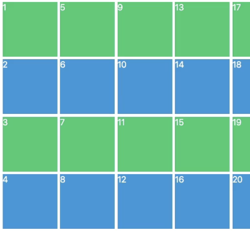
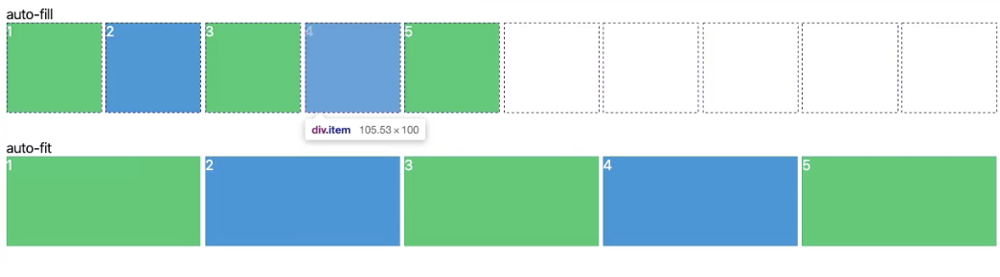
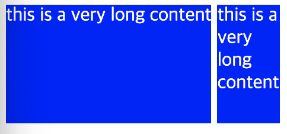

# css_layout_master

## 1. GRID

### [grid의 justify-items, align-items]()

### auto columns and rows

```css
.grid {
  display: grid;
  grid-template-columns: repeat(4, 100px);
  grid-template-rows: repeat(4, 100px);
}
```

위의 상황에서 셀이 16개를 넘어간다면 row의 높이가 17개부터는 작아질 것이다. 예상 못한 높이를 지정해주고 싶으면 `grid-auto-rows : 100px`를 추가해주면 16개를 넘어가도 높이는 100px을 유지한다.

```css
.grid {
  display: grid;
  grid-template-columns: repeat(4, 100px);
  grid-template-rows: repeat(4, 100px);
  grid-auto-flow: column;
}
```

grid-auto-flow는 진행방향을 바꾼다. 아래 이미지를 보자.


### minmax

minmax는 1fr과 사용하면 유용하다. 아래 코드를 보자

```css
.grid {
  display: grid;
  grid-template-columns: repeat(4, minmax(100px, 1fr));
  grid-template-rows: repeat(4, 100px);
}
```

위와 같이 코드를 작성하면 1fr이 100px 보다 작으면 100px로 1fr이 100px보다 크면 1fr로 유지된다.

### auto-fit, auto-fill

auto-fit과 auto-fill은 repeat과 함께 사용되는 것으로 아래 코드와 그 결과를 보자.

```css
.grid {
  display: grid;
  grid-template-columns: repeat(auto-fill, minmax(100px, 1fr));
  grid-template-rows: repeat(4, 100px);
}

.grid {
  display: grid;
  grid-template-columns: repeat(auto-fit, minmax(100px, 1fr));
  grid-template-rows: repeat(4, 100px);
}
```



- auto-fill은 최대 그리드 수를 목표로 한다. (그러기 위해서 각 셀 너비가 최소로 되겠죠?)
- auto-fit은 최대 셀 너비를 목표로 한다.

### min-content, max-content

```css
.grid {
  display: grid;
  grid-template-columns: min-content max-content;
  grid-auto-rows: 100px;
}
```

min-content, max-content는 px, fr 과 같은 단위와 다르게 셀이 포함한 content에 따라 변한다. max-content는 content에 맞게 최대로 늘어나고 min-content는 content를 최소로 잘라 맞춘다. 아래의 예시가 적절하다.



## 2. SCSS

### variables

variable scss 파일을 만들때 파일명에 underline(\_)을 붙이는데 css로 변환하지 않고 styles.scss 파일만을 위한 파일이라는 것을 뜻한다.

변수 선언 예시는 아래와 같다. 달러 표시를 변수명에 붙여준다.

```scss
$bg: black;
```

### Mixins

mixin은 scss funcianality를 재사용하게 해준다. 만약 변수를 넣고 싶지 않다면 Extends를 확인하자.

1. \_mixins.scss 파일을 만들어 준다.

```scss
@mixin customTitle($color) {
  color: $color;
  font-size: 30px;
  margin-bottom: 12px;
}
```

2. styles.scss 파일에 서 @import "\_mixins";
3. @include

```scss
h1 {
  @include customTitle(blue);
}
```

일반적인 프로그래밍 언어의 함수 사용법과 비슷하다.

4. 응용

mixin의 변수로 텍스트를 보낼 수도 있다.

```scss
@mixin customTitle($word) {
  @if $word == "odd" {
    color: blue;
  } @else {
    color: red;
  }
  font-size: 30px;
  margin-bottom: 12px;
}
```

5. @content

```scss
@mixin customTitle() {
  color: blue;
  @content;
}
```

위와 같이 mixin 선언에 @content를 넣어준다.

```scss
a {
  @include customTitle {
    text-decoration: none;
  }
}
```

a에 적용했다고 하면 a는 결과적으로 아래와 동일하다.

```scss
a {
  color: blue;
  text-decoration: none;
}
```

6. @content 응용

```scss
@mixin responsive($device) {
  @if $device == "iphone" {
    @media screen and (min-width: 500px) and (max-width: 690px) {
      @content;
    }
  } @else if $device == "tablet" {
    @media screen and (min-width: 691px) and (max-width: 800px) {
      @content;
  }
}
```

위에 작성한 mixin을 아래와 같이 사용할 수 있다.

```scss
h1 {
  color: red; // 기본 칼라

  @include responsive("iphone") {
    color: yellow;
  }

  @include responsive("tablet") {
    color: blue;
  }
}
```

이렇게 사용하면 사용 범위가 굉장히 넓어지죠,, 다른 element에선 color말고 다른 것을 변경할 수도 있죠. font-size라던가..
@content의 힘이군요. 덧붙이자면 "iphone" 이나 "tablet"은 trigger 역할만 하고 엄청난 의미는 없죠. text일뿐이니까요.
[mixin 추천 bourbon](https://www.bourbon.io/docs/4/)

### Extends

1. 선언 방법
   파일을 만들고 (ex) \_button.scss) 파일 안에 아래와 같이 작성한다.

   ```scss
   %button {
     border-radius: 50px;
     font-size: 100px;
     text-transform: uppercase;
     padding: 10px;
   }
   ```

2. @import
3. styles.scss에서 사용

   ```scss
   a {
     @extend %button;
   }

   button {
     @extend %button;
   }
   ```

   a와 button에 동일한 스타일이 적용된다.
